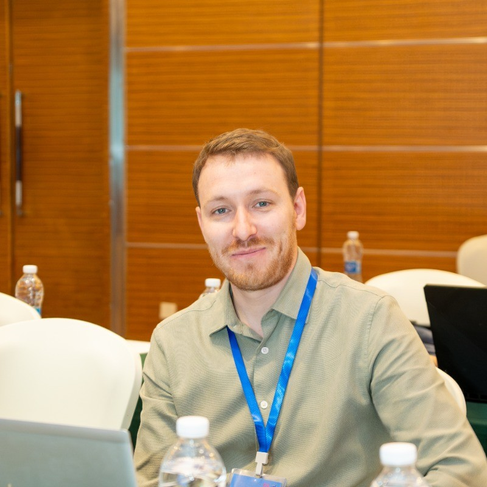

# About me

	

Hello! I am an instrumentation physicist who earned my PhD from the University of Leicester in 2022. My doctoral research was titled "The hard X-ray performance of pixelated CdTe-based detectors using Monte Carlo and ab initio simulations".

I am currently a Research Associate at the University of Leicester, where my primary responsibility is the operation of the Soft X-ray Imager (SXI) instrument on board the ESA/CAS SMILE mission, and the development of software to support this.

My main research interests lie in instrumentation for X-ray and gamma-ray detection in space, with a particular focus on compound semiconductor detectors such as CdTe and CdZnTe. In my work I typically combine experimental studies with computational simulations using models employing methods such as Monte Carlo or density functional theory (DFT).
